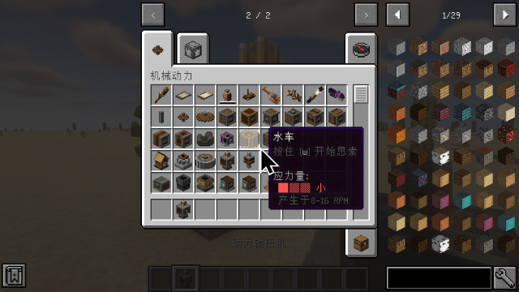

# 前言

首先, 恭喜你选择了PonderJS!

「思索」是机械动力模组提供的一种直观的物品功能演示方法, 可以用动画演示的形式让玩家直观的理解游戏内的某个元素的的各种用法特性

> 图一 : 在机械动力的思索目录内对添加的 "铁傀儡" 进行查看
> 

> 图二 : 在游戏内对物品栏内的 "动力辊压机" 长按 w 进行思索
> 

# PonderJS 魔改概览

正如上方动图所展示的, 思索拥有这些要素 :

- **条目和关联词条** : 一个条目内可以包含若干物品(即「关联词条」)
  
  相关内容请见[PonderTags.md](https://github.com/Qi-Month/PonderJs-Tutorials/blob/main/PonderTags.md)。

- **思索场景**

  一个物品可以有多个思索场景, 一个场景内可能包含以下元素 :

  - 关键帧

    关键帧是下方思索进度条上面的小竖线, 玩家可以点击他们来快速的跳转到某一部分
    
  - 说明文本、交互操作示意

    这些元素会显示在hud上, 通常用来提供文本信息和玩家操作描述

  - 平台、展示方块、实体
    
    这是思索的主要内容, 在思索场景内, 可以配合其他的各种元素来对思索主题进行讲解

  - 动力学属性
    
    通过修改部分方块的动力学属性, 我们可以让思索场景中的应力网络真正旋转起来

  - 连接线、外框

    连接线和外框可以用来突出显示某些方块, 强调连接的二者的关系等

  相关内容请见[Ponder.md](https://github.com/Qi-Month/PonderJs-Tutorials/blob/main/Ponder.md)

- **基本概念和实用工具**

  您可能需要了解一些基础知识和基本概念来愉快的编写 PonderJS, 同时您也可能需要一些实用工具来加速思索场景的构建一类
  
  相关内容请见[Utils.md](https://github.com/Qi-Month/PonderJs-Tutorials/blob/main/Utils.md)

- **语言文件**
  
  语言文件通过用标识符代替所有的文字, 将所有的文本都独立了出来
  
  这有助于国际化翻译, 和集中检查错误

  相关内容请见[PonderLang.md](https://github.com/Qi-Month/PonderJs-Tutorials/blob/main/PonderLang.md)

*最后,魔改愉快!*
